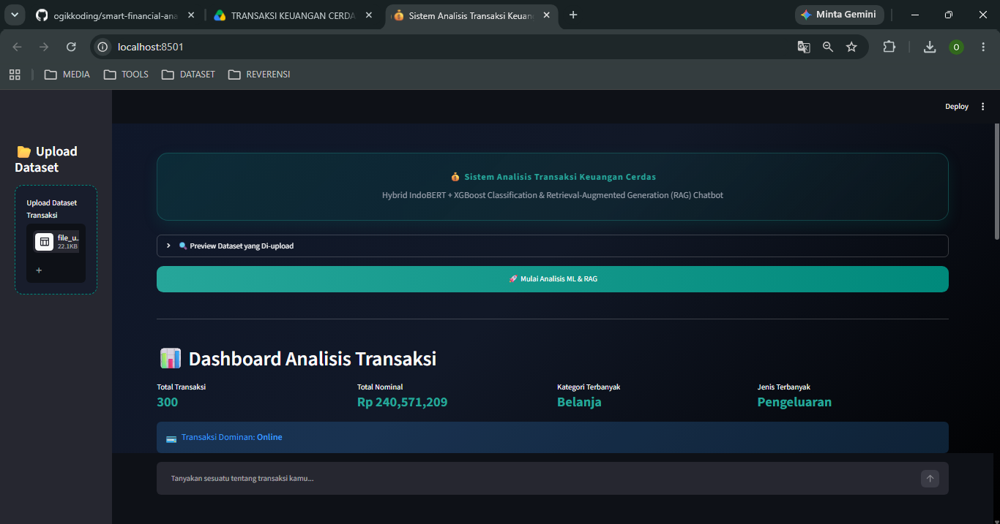
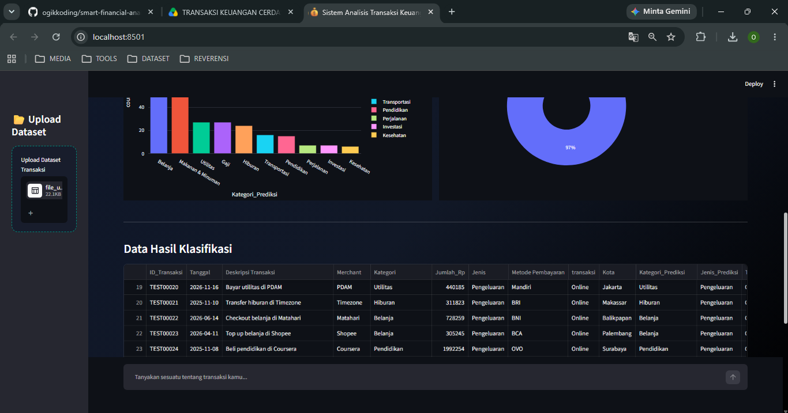
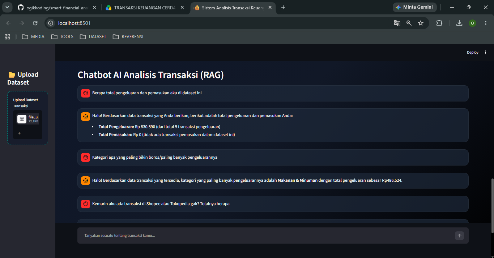
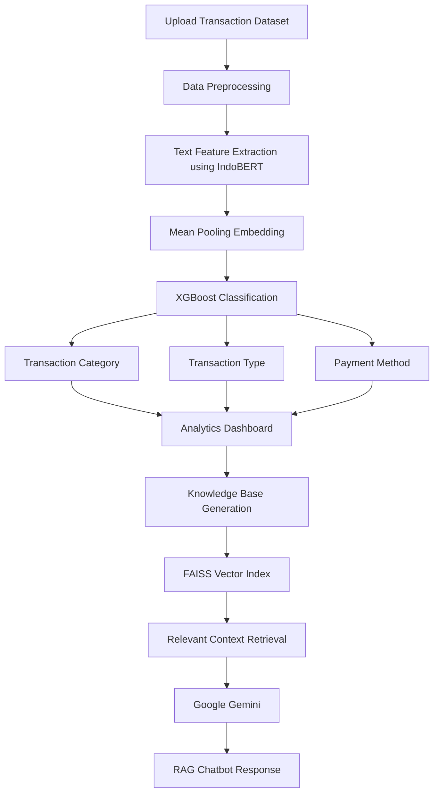
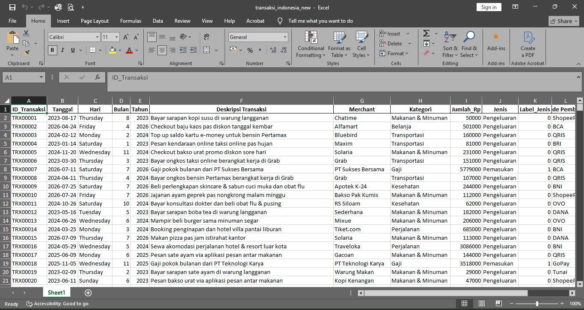

# 💰 [# Sistem Analisis Transaksi Keuangan Cerdas Menggunakan Hybrid IndoBERT + XGBoost & RAG Chatbot](https://smart-financial-analysis-ai-9ypu8ie3j5zkyqmq2admfm.streamlit.app/)


🚀 **Live Demo:** [Coba Aplikasi Web di Sini](https://smart-financial-analysis-ai-9ypu8ie3j5zkyqmq2admfm.streamlit.app/)

## 📖 Deskripsi

Proyek ini bertujuan untuk membangun sistem analisis transaksi keuangan cerdas yang memanfaatkan kombinasi metode **Artificial Intelligence (AI)**, yaitu **Machine Learning** dan **Retrieval-Augmented Generation (RAG)**. Sistem dirancang untuk membantu pengguna menganalisis data transaksi secara otomatis dengan mengklasifikasikan transaksi berdasarkan kategori, jenis transaksi, dan metode pembayaran.

Dalam proses klasifikasi, sistem menggunakan pendekatan **Hybrid IndoBERT-XGBoost**, yaitu **IndoBERT** sebagai _feature extractor_ untuk menghasilkan representasi teks transaksi dan **XGBoost** sebagai _classifier_ untuk melakukan prediksi. Hasil analisis kemudian disajikan dalam bentuk dashboard interaktif yang memudahkan pengguna memahami pola transaksi.

Selain melakukan analisis dan klasifikasi, sistem juga menyediakan chatbot berbasis **Retrieval-Augmented Generation (RAG)** yang memungkinkan pengguna mengajukan pertanyaan mengenai hasil analisis transaksi. Chatbot memanfaatkan basis pengetahuan yang telah dibangun untuk menghasilkan jawaban yang relevan dan informatif.

Aplikasi dikembangkan menggunakan **Streamlit** sebagai antarmuka web interaktif sehingga pengguna dapat melakukan analisis transaksi, memvisualisasikan hasil, dan berinteraksi dengan chatbot melalui satu platform yang terintegrasi.

---

# 🖼️ Tampilan Aplikasi

### 🏠 Halaman Utama

> Tampilan awal aplikasi sebelum proses analisis transaksi.



---

### 📊 Dashboard Analisis dan Prediksi

> Dashboard interaktif yang menampilkan hasil analisis transaksi.



---

### 🤖 Chatbot RAG

> Chatbot berbasis Retrieval-Augmented Generation (RAG) yang dapat menjawab pertanyaan mengenai hasil analisis transaksi.



---

### 🎥 Live Demo / Alur Kerja

> Alur kerja interaktif chatbot RAG yang menampilkan analisis transaksi dan fitur tanya jawab secara real-time.

## 

---

# ✨ Fitur

- 📂 Upload dataset transaksi dalam format **CSV** atau **Excel (.xlsx)**.
- 🏷️ Prediksi **kategori transaksi** _(Belanja, Gaji, Hiburan, Investasi, Kesehatan, Makanan & Minuman, Pendidikan, Perjalanan, Transportasi, dan Utilitas)._
- 💰 Prediksi **jenis transaksi** _(Pemasukan dan Pengeluaran)._
- 💳 Prediksi **metode pembayaran** _(BNI, BCA, BRI, Mandiri, QRIS, OVO, GoPay, DANA, ShopeePay, dan Tunai)._
- 📊 Dashboard interaktif untuk visualisasi dan analisis hasil prediksi.
- 📥 Download hasil analisis dan prediksi.
- 🧠 Pembuatan **Knowledge Base** secara otomatis dari data transaksi.
- 🤖 Chatbot berbasis **Retrieval-Augmented Generation (RAG)** untuk menjawab pertanyaan mengenai hasil analisis transaksi.
- 🔍 Pencarian informasi yang relevan menggunakan **FAISS Vector Database**.
- ✨ Integrasi **Google Gemini** untuk menghasilkan respons chatbot yang informatif dan kontekstual.

---

# 🧠 Metode

## Machine Learning

Metode klasifikasi transaksi pada sistem ini menggunakan pendekatan **Hybrid IndoBERT-XGBoost**, dengan tahapan sebagai berikut:

- **IndoBERT Base** sebagai **text encoder** untuk mengubah teks transaksi menjadi representasi vektor (embedding).
- **Mean Pooling** untuk menghasilkan embedding dari keluaran token IndoBERT.
- **XGBoost Classifier** sebagai model klasifikasi yang memanfaatkan embedding hasil encoding untuk melakukan prediksi.

### Model Klasifikasi

Sistem menggunakan tiga model klasifikasi yang dilatih secara terpisah, yaitu:

- 🏷️ **Model Kategori Transaksi**
- 💰 **Model Jenis Transaksi**
- 💳 **Model Metode Pembayaran**

---

# 🤖 Chatbot

Metode chatbot menggunakan:

- Retrieval-Augmented Generation (RAG)
- FAISS Vector Search
- Google Gemini

---

# 🔄 System Pipeline

The overall workflow of the intelligent financial transaction analysis system consists of the following stages:



---

# 🏗️ Project Structure

```text
project/
│
├── STREAMLIT_FINANCE/
│   ├── app.py
│   └── run.bat
│
├── DATASET/
│   └── transaksi_indonesia.xlsx
│
├── MODELS/
│   ├── xgb_model_kategori.json
│   ├── xgb_model_jenis.json
│   ├── xgb_model_pembayaran.json
│   ├── encoder_kategori.npy
│   ├── encoder_jenis.npy
│   ├── encoder_pembayaran.npy
│
├── IMAGES/
│   ├── home.png
│   ├── analisis.png
│   ├── chatbot.png
│   ├── dataset.png
│   ├── pipeline.png
│   ├── architecture.png
│   └── Smart_finance.gif
│
├── requirements.txt
└── README.md
```

---

# 🛠️ Tech Stack

This project was developed using the following technologies and libraries:

- 🐍 Python
- 🌐 Streamlit
- 🤗 Hugging Face Transformers
- 🧠 IndoBERT Base
- 🌲 XGBoost
- 📊 Scikit-learn
- 📈 Plotly
- 🔍 FAISS
- 🐼 Pandas
- 🔢 NumPy
- 🤖 Google Gemini API

---

# 📊 System Output

After processing the uploaded transaction dataset, the application provides:

- 🏷️ Predicted Transaction Category
- 💰 Predicted Transaction Type
- 💳 Predicted Payment Method
- 📊 Interactive Financial Analytics Dashboard
- 📈 Transaction Data Visualization
- 📥 Downloadable Prediction Results
- 🧠 Automatically Generated Knowledge Base
- 🤖 AI-powered RAG Chatbot for Financial Analysis

---

# 📂 Dataset

This project utilizes a **synthetic financial transaction dataset** created specifically for research, experimentation, and educational purposes.

Each transaction record contains financial information such as:

- 📅 Transaction Date
- 🏪 Merchant Name
- 📝 Transaction Description
- 💵 Transaction Amount
- 🏷️ Transaction Category
- 💰 Transaction Type
- 💳 Payment Method

The dataset is used to train and evaluate the three classification models as well as to construct the Knowledge Base for the Retrieval-Augmented Generation (RAG) chatbot.

---

# 🖼️ Dataset Sample

A sample of the transaction dataset used for model training and testing.



---

# 🚀 Getting Started

## 1. Clone the Repository

```bash
git clone https://github.com/ogikkoding/nama-repository.git
```

---

## 2. Navigate to the Project Directory

```bash
cd nama-repository
```

---

## 3. Install the Required Dependencies

```bash
pip install -r requirements.txt
```

---

## 4. Launch the Streamlit Application

```bash
streamlit run app.py
```

After the server starts successfully, Streamlit will automatically open the application in your default web browser.

---

# 💻 Development Environment

This project was developed using:

- ☁️ Google Colab (Model Training)
- 💾 Google Drive (Model Storage)
- 💻 Visual Studio Code (Application Development)
- 🌐 Streamlit (Web Deployment)

---

# 👨‍💻 Developer

## Yogi Irawan

**Undergraduate Student of Informatics Engineering**

### Research Interests

- Artificial Intelligence
- Natural Language Processing
- Machine Learning
- Large Language Models
- Retrieval-Augmented Generation

### Contact

📧 **Email**

yogiirawan490@gmail.com

💼 **LinkedIn**

https://www.linkedin.com/in/yogi-irawan-ab146a387

🐙 **GitHub**

https://github.com/ogikkoding

---

# 🤝 Contributing

Contributions are welcome!

If you encounter bugs, have ideas for improvements, or would like to contribute new features, feel free to:

- Open an Issue
- Submit a Pull Request

---

# ⭐ Support

If you find this project useful, please consider giving it a ⭐ on GitHub.

Your support helps encourage further development and future improvements.

---

# 📄 License

This project is distributed under the **MIT License**.

Copyright © 2026 **Yogi Irawan**
