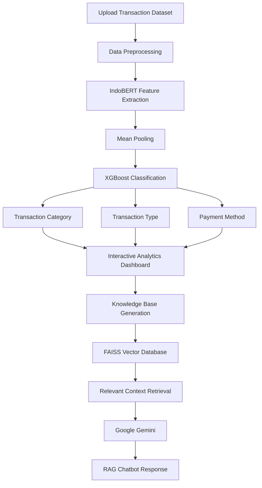

# 💰 Intelligent Financial Transaction Analysis System Using Hybrid Machine Learning and Retrieval-Augmented Generation (RAG)


> An intelligent financial transaction analysis system built with **Streamlit**, combining **Machine Learning** and **Retrieval-Augmented Generation (RAG)**. The application automatically classifies financial transactions, visualizes analytical insights, and provides an AI-powered chatbot capable of answering questions based on transaction data.

---

# 📖 Overview

This project introduces an intelligent web-based financial transaction analysis system that integrates **Machine Learning**, **Natural Language Processing (NLP)**, and **Large Language Models (LLMs)** to automate transaction analysis.

The classification component employs a **Hybrid IndoBERT-XGBoost** architecture. Rather than using IndoBERT as an end-to-end classifier, the pretrained **IndoBERT Base** model acts as a **feature extractor** that converts transaction descriptions into contextual embedding vectors. These embeddings are then classified using **XGBoost**, resulting in efficient and accurate predictions.

The system simultaneously predicts three transaction attributes:

- 🏷️ Transaction Category
- 💰 Transaction Type
- 💳 Payment Method

Beyond classification, the application automatically generates a **Knowledge Base** from uploaded transaction data. The knowledge base is indexed using **FAISS**, enabling efficient semantic retrieval. Retrieved information is subsequently utilized by **Google Gemini** through a **Retrieval-Augmented Generation (RAG)** pipeline, allowing users to interact naturally with their financial data via an intelligent chatbot.

The entire workflow is deployed using **Streamlit**, providing an interactive dashboard for transaction analysis, visualization, prediction, and conversational AI.

---

# ✨ Key Features

- 📂 Upload financial transaction datasets (.csv or .xlsx)
- 🏷️ Automatic transaction category classification
- 💰 Automatic transaction type prediction
- 💳 Automatic payment method prediction
- 📊 Interactive financial analytics dashboard
- 📈 Data visualization using Plotly
- 📥 Download prediction results
- 🧠 Automatic Knowledge Base generation
- 🔍 Semantic document retrieval using FAISS
- 🤖 Retrieval-Augmented Generation (RAG) chatbot
- ✨ Google Gemini integration for contextual question answering

---

# 🖼️ Application Preview

## 🏠 Home Page

Landing page before transaction analysis.


---

## 📊 Analytics Dashboard

Interactive dashboard displaying classification results and financial insights.


---

## 🤖 RAG Chatbot

AI-powered chatbot capable of answering questions about transaction analysis.


---

## 🎥 Application Workflow

Complete workflow from dataset upload to intelligent chatbot interaction.


---

# 🧠 Methodology

## Hybrid Machine Learning

The transaction classification pipeline follows a hybrid architecture:

- **IndoBERT Base** as a pretrained text encoder
- **Mean Pooling** for sentence embedding generation
- **XGBoost** as the final classifier

Instead of fine-tuning IndoBERT for classification, contextual embeddings extracted from IndoBERT are utilized as feature vectors for XGBoost.

---

## Classification Models

Three independent classification models were developed:

- 🏷️ Transaction Category Model
- 💰 Transaction Type Model
- 💳 Payment Method Model

---

## Retrieval-Augmented Generation (RAG)

The conversational AI module combines:

- Google Gemini
- FAISS Vector Database
- Semantic Retrieval
- Knowledge Base Generation

---

# 🔄 System Pipeline

The intelligent financial transaction analysis system follows the workflow below:



The workflow begins when users upload a financial transaction dataset. The transaction text is preprocessed and transformed into contextual embeddings using **IndoBERT** with **Mean Pooling**. These embeddings are then classified by **XGBoost** to predict the transaction category, transaction type, and payment method.

The prediction results are presented through an interactive analytics dashboard. Subsequently, the analyzed data is automatically converted into a knowledge base and indexed using **FAISS**. When users interact with the chatbot, relevant information is retrieved from the vector database and provided to **Google Gemini**, enabling context-aware responses through the **Retrieval-Augmented Generation (RAG)** framework.

---

# 🏗️ Project Structure

```text
project/
│
├── STREAMLIT_FINANCE/
│   ├── app.py
│   └── run.bat
│
├── DATASET/
│   └── transaksi_indonesia.xlsx
│
├── MODELS/
│   ├── xgb_model_kategori.json
│   ├── xgb_model_jenis.json
│   ├── xgb_model_pembayaran.json
│   ├── encoder_kategori.npy
│   ├── encoder_jenis.npy
│   ├── encoder_pembayaran.npy
│
├── IMAGES/
│   ├── home.png
│   ├── analisis.png
│   ├── chatbot.png
│   ├── dataset.png
│   ├── pipeline.png
│   ├── architecture.png
│   └── Smart_finance.gif
│
├── requirements.txt
└── README.md
```

---

# 🛠️ Technology Stack

This project was developed using the following technologies and libraries:

- 🐍 Python
- 🌐 Streamlit
- 🤗 Hugging Face Transformers
- 🧠 IndoBERT Base
- 🌲 XGBoost
- 📊 Scikit-learn
- 📈 Plotly
- 🔍 FAISS
- 🐼 Pandas
- 🔢 NumPy
- 🤖 Google Gemini API

---

# 📊 System Output

After processing the uploaded dataset, the application provides:

- 🏷️ Predicted Transaction Category
- 💰 Predicted Transaction Type
- 💳 Predicted Payment Method
- 📊 Interactive Financial Analytics Dashboard
- 📈 Transaction Visualization
- 📥 Downloadable Prediction Results
- 🧠 Automatically Generated Knowledge Base
- 🤖 AI-powered RAG Chatbot for Transaction Analysis

---

# 📂 Dataset

This project utilizes a **synthetic financial transaction dataset** created for research, experimentation, and educational purposes.

Each transaction record contains information such as:

- 📅 Transaction Date
- 🏪 Merchant Name
- 📝 Transaction Description
- 💵 Transaction Amount
- 🏷️ Transaction Category
- 💰 Transaction Type
- 💳 Payment Method

The dataset is used to train and evaluate the three machine learning models while also serving as the primary data source for building the chatbot's knowledge base.

---

# 🖼️ Dataset Sample

The following figure illustrates a sample of the financial transaction dataset used during model training and evaluation.


---

# 🚀 Getting Started

### 1. Clone the Repository

```bash
git clone https://github.com/ogikkoding/nama-repository.git
```

### 2. Navigate to the Project Directory

```bash
cd nama-repository
```

### 3. Install Dependencies

```bash
pip install -r requirements.txt
```

### 4. Run the Streamlit Application

```bash
streamlit run app.py
```

Once the server starts successfully, the application will automatically open in your default web browser.

---

# 💻 Development Environment

This project was developed using:

- ☁️ Google Colab (Model Training)
- 💾 Google Drive (Model Storage)
- 💻 Visual Studio Code (Application Development)
- 🌐 Streamlit (Web Application Deployment)

---

# 👨‍💻 Developer

## Yogi Irawan

**Undergraduate Student in Informatics Engineering**

### Research Interests

- Artificial Intelligence
- Natural Language Processing
- Machine Learning
- Large Language Models
- Retrieval-Augmented Generation (RAG)

### Contact

📧 **Email**

yogiirawan490@gmail.com

💼 **LinkedIn**

https://www.linkedin.com/in/yogi-irawan-ab146a387

🐙 **GitHub**

https://github.com/ogikkoding

---

# 🤝 Contributing

Contributions are welcome!

If you discover bugs, have suggestions for improvements, or would like to contribute new features, please feel free to:

- Open an Issue
- Submit a Pull Request

---

# ⭐ Support

If you find this project useful, please consider giving it a ⭐ on GitHub.

Your support helps encourage future development and continuous improvement.

---

# 📄 License

This project is distributed under the **MIT License**.

Copyright © 2026 **Yogi Irawan**
