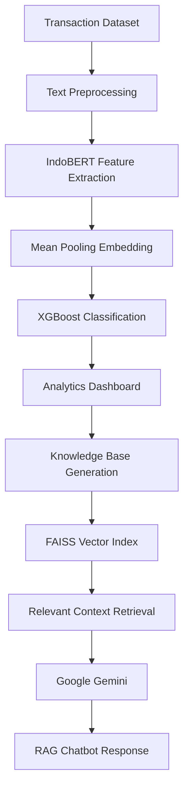

# 💰 Intelligent Financial Transaction Analysis System Using Hybrid Machine Learning and Retrieval-Augmented Generation (RAG)


> An intelligent financial transaction analysis system built with **Streamlit**, combining **Machine Learning** and **Retrieval-Augmented Generation (RAG)**. The application automatically classifies financial transactions, visualizes analytical insights, and provides an AI-powered chatbot capable of answering questions based on transaction data.

---

# 📖 Overview

This project introduces an intelligent web-based financial transaction analysis system that integrates **Machine Learning**, **Natural Language Processing (NLP)**, and **Large Language Models (LLMs)** to automate transaction analysis.

The classification component employs a **Hybrid IndoBERT-XGBoost** architecture. Rather than using IndoBERT as an end-to-end classifier, the pretrained **IndoBERT Base** model acts as a **feature extractor** that converts transaction descriptions into contextual embedding vectors. These embeddings are then classified using **XGBoost**, resulting in efficient and accurate predictions.

The system simultaneously predicts three transaction attributes:

- 🏷️ Transaction Category
- 💰 Transaction Type
- 💳 Payment Method

Beyond classification, the application automatically generates a **Knowledge Base** from uploaded transaction data. The knowledge base is indexed using **FAISS**, enabling efficient semantic retrieval. Retrieved information is subsequently utilized by **Google Gemini** through a **Retrieval-Augmented Generation (RAG)** pipeline, allowing users to interact naturally with their financial data via an intelligent chatbot.

The entire workflow is deployed using **Streamlit**, providing an interactive dashboard for transaction analysis, visualization, prediction, and conversational AI.

---

# ✨ Key Features

- 📂 Upload financial transaction datasets (.csv or .xlsx)
- 🏷️ Automatic transaction category classification
- 💰 Automatic transaction type prediction
- 💳 Automatic payment method prediction
- 📊 Interactive financial analytics dashboard
- 📈 Data visualization using Plotly
- 📥 Download prediction results
- 🧠 Automatic Knowledge Base generation
- 🔍 Semantic document retrieval using FAISS
- 🤖 Retrieval-Augmented Generation (RAG) chatbot
- ✨ Google Gemini integration for contextual question answering

---

# 🖼️ Application Preview

## 🏠 Home Page

Landing page before transaction analysis.


---

## 📊 Analytics Dashboard

Interactive dashboard displaying classification results and financial insights.


---

## 🤖 RAG Chatbot

AI-powered chatbot capable of answering questions about transaction analysis.


---

## 🎥 Application Workflow

Complete workflow from dataset upload to intelligent chatbot interaction.


---

# 🧠 Methodology

## Hybrid Machine Learning

The transaction classification pipeline follows a hybrid architecture:

- **IndoBERT Base** as a pretrained text encoder
- **Mean Pooling** for sentence embedding generation
- **XGBoost** as the final classifier

Instead of fine-tuning IndoBERT for classification, contextual embeddings extracted from IndoBERT are utilized as feature vectors for XGBoost.

---

## Classification Models

Three independent classification models were developed:

- 🏷️ Transaction Category Model
- 💰 Transaction Type Model
- 💳 Payment Method Model

---

## Retrieval-Augmented Generation (RAG)

The conversational AI module combines:

- Google Gemini
- FAISS Vector Database
- Semantic Retrieval
- Knowledge Base Generation

---

# 🔄 System Pipeline



---

# 🏗️ Project Structure

```text
project/
│
├── STREAMLIT_FINANCE/
│   ├── app.py
│   └── run.bat
│
├── DATASET/
│   └── transaksi_indonesia.xlsx
│
├── MODELS/
│   ├── xgb_model_kategori.json
│   ├── xgb_model_jenis.json
│   ├── xgb_model_pembayaran.json
│   ├── encoder_kategori.npy
│   ├── encoder_jenis.npy
│   └── encoder_pembayaran.npy
│
├── IMAGES/
│   ├── home.png
│   ├── analisis.png
│   ├── chatbot.png
│   ├── dataset.png
│   ├── pipeline.png
│   ├── architecture.png
│   └── Smart_finance.gif
│
├── requirements.txt
└── README.md
```

---

# 🛠️ Tech Stack

The application was developed using:

- 🐍 Python
- 🌐 Streamlit
- 🤗 Hugging Face Transformers
- 🧠 IndoBERT Base
- 🌲 XGBoost
- 📊 Scikit-learn
- 📈 Plotly
- 🔍 FAISS
- 🐼 Pandas
- 🔢 NumPy
- 🤖 Google Gemini API

---

# 📊 Prediction Output

The application provides:

- 🏷️ Transaction Category
- 💰 Transaction Type
- 💳 Payment Method
- 📊 Financial Dashboard
- 📈 Interactive Visualizations
- 📥 Downloadable Prediction Results
- 🤖 AI-powered Financial Assistant

---

# 📂 Dataset

The project utilizes a **synthetic financial transaction dataset** generated for research and educational purposes.

The dataset contains transaction information including:

- Merchant
- Transaction Description
- Transaction Category
- Transaction Type
- Payment Method
- Transaction Amount
- Transaction Date

---

## 🖼️ Dataset Sample


---

# 🚀 Getting Started

## 1. Clone Repository

```bash
git clone https://github.com/ogikkoding/nama-repository.git
```

---

## 2. Navigate to the Project Directory

```bash
cd nama-repository
```

---

## 3. Install Dependencies

```bash
pip install -r requirements.txt
```

---

## 4. Launch the Streamlit Application

```bash
streamlit run app.py
```

The application will automatically open in your default web browser.

---

# 💻 Development Environment

Developed using:

- Google Colab
- Visual Studio Code
- Google Drive
- Streamlit

---

# 👨‍💻 Developer

## Yogi Irawan

**Undergraduate Student of Informatics Engineering**

### Research Interests

- Artificial Intelligence
- Natural Language Processing
- Machine Learning
- Large Language Models
- Retrieval-Augmented Generation

### Contact

📧 Email

yogiirawan490@gmail.com

💼 LinkedIn

https://www.linkedin.com/in/yogi-irawan-ab146a387

🐙 GitHub

https://github.com/ogikkoding

---

# 🤝 Contributing

Contributions are welcome!

If you encounter bugs, have suggestions, or wish to contribute new features, feel free to:

- Open an Issue
- Submit a Pull Request

---

# 🔮 Future Improvements

Potential future enhancements include:

- 📱 REST API deployment using FastAPI
- ☁️ Cloud deployment with Docker
- 📈 Time-series financial forecasting
- 💹 Personal financial recommendation engine
- 🧠 Fine-tuning Indonesian LLMs for finance
- 🔍 Hybrid Retrieval using BM25 + FAISS
- 📊 Explainable AI (SHAP) for XGBoost predictions

---

# 🙏 Acknowledgements

Special thanks to the open-source community and the following projects:

- Hugging Face Transformers
- Google Gemini
- FAISS
- Streamlit
- XGBoost
- Scikit-learn
- Plotly

---

# ⭐ Support

If you find this project useful, please consider giving it a ⭐ on GitHub.

Your support motivates continued development and future improvements.

---

# 📄 License

This project is licensed under the **MIT License**.

Copyright © 2026 **Yogi Irawan**
